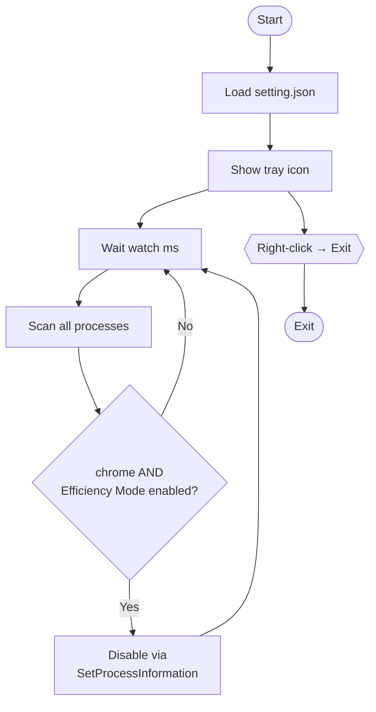

# NoNapChrome

Wake up, Chrome! A system tray app that jolts Chrome out of its nap.  
Automatically detects and disables Chrome's Efficiency Mode (EcoQoS).

[日本語版はこちら](README.md)

## Overview

Windows 11 may place background processes into "Efficiency Mode," applying CPU throttling under certain conditions.  
When Chrome is caught napping like this, rendering and script execution slow to a crawl.  
NoNapChrome watches over Chrome and wakes it up the moment it dozes off — no naps allowed.

## Features

- Runs as a system tray icon with no visible window
- Periodically scans all processes for Efficiency Mode
- Automatically disables Efficiency Mode for any `chrome` process detected
- Monitoring interval configurable via `setting.json`
- Exit from the tray icon right-click menu

## Requirements

| Item | Requirement |
|------|-------------|
| OS | Windows 11 |
| Runtime | .NET 10 |
| Privileges | Standard user (no admin required) |

## Installation

1. Download and extract the latest zip from the Releases page, or build from source
2. Place `NoNapChrome.exe` in any folder
3. Double-click `NoNapChrome.exe` to run

### Build from source

```bash
git clone <repository-url>
cd NoNapChrome
dotnet build -c Release
```

## Configuration

Edit `setting.json` in the same folder as the executable to adjust behavior.

```json
{"watch":1000}
```

| Key | Type | Default | Description |
|-----|------|---------|-------------|
| `watch` | integer (ms) | `1000` | Monitoring loop interval in milliseconds |

- If `setting.json` is missing or contains an invalid value, the default of `1000ms` is used
- A restart is required after changing the file

## Usage

1. Run `NoNapChrome.exe` — a tray icon will appear
2. The app continuously monitors and disables Chrome's Efficiency Mode in the background
3. To exit, right-click the tray icon and select **Exit**

## How it works

Efficiency Mode is detected and disabled via the Windows API `GetProcessInformation` / `SetProcessInformation` with the `ProcessPowerThrottling` information class.



## License

MIT — [130cmWolf](https://github.com/130cmWolf/NoNapChrome)
