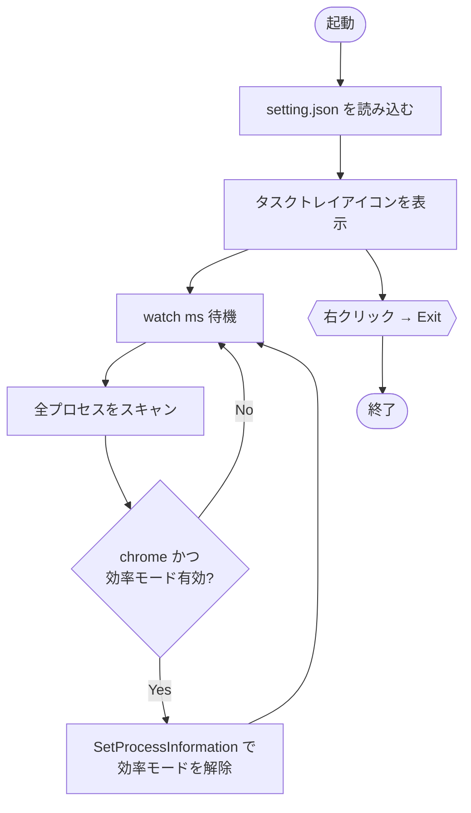

# NoNapChrome

昼寝している Chrome をたたき起こす、タスクトレイ常駐アプリです。  
Chrome の効率モード（EcoQoS）を自動で検出・解除します。

[English README](README-en.md)

## 概要

Windows 11 は一定条件下でバックグラウンドプロセスを「効率モード」に移行し、CPU スロットリングをかけます。  
Chrome がこの対象になると、描画やスクリプト実行が鈍くなることがあります。  
NoNapChrome はそんな Chrome を見つけ次第たたき起こし、効率モードを解除します。  
昼寝は許しません。

## 機能

- タスクトレイに常駐し、UI を占有しない
- 効率モード状態のプロセスを定期スキャン
- プロセス名が `chrome` のプロセスを検出した場合、効率モードを自動解除
- 監視間隔は `setting.json` で変更可能
- タスクトレイアイコンの右クリックメニューから終了

## 動作環境

| 項目 | 要件 |
|------|------|
| OS | Windows 11 |
| ランタイム | .NET 10 |
| 権限 | 一般ユーザー権限で動作 |

## インストール

1. リリースページから最新の zip をダウンロードして展開する、または自分でビルドする
2. `NoNapChrome.exe` を任意のフォルダに配置する
3. `NoNapChrome.exe` をダブルクリックして実行する

### 自分でビルドする場合

```bash
git clone <repository-url>
cd NoNapChrome
dotnet build -c Release
```

## 設定

実行ファイルと同じフォルダにある `setting.json` で動作を調整できます。

```json
{"watch":1000}
```

| キー | 型 | 既定値 | 説明 |
|------|----|--------|------|
| `watch` | 整数 (ms) | `1000` | 監視ループの実行間隔（ミリ秒） |

- `setting.json` が存在しない、または値が不正な場合は既定値 `1000ms` で動作します
- 変更後は再起動が必要です

## 使い方

1. `NoNapChrome.exe` を実行するとタスクトレイにアイコンが表示される
2. 以降は自動で Chrome の効率モードを監視・解除し続ける
3. 終了する場合はタスクトレイアイコンを右クリックし **Exit** を選択する

## 仕組み

Windows API の `GetProcessInformation` / `SetProcessInformation` に  
`ProcessPowerThrottling` クラスを指定することで効率モードの検出と解除を行っています。



## ライセンス

MIT — [130cmWolf](https://github.com/130cmWolf/NoNapChrome)
